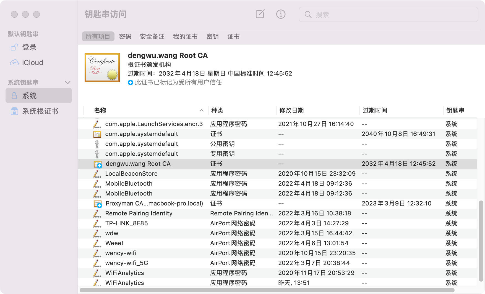
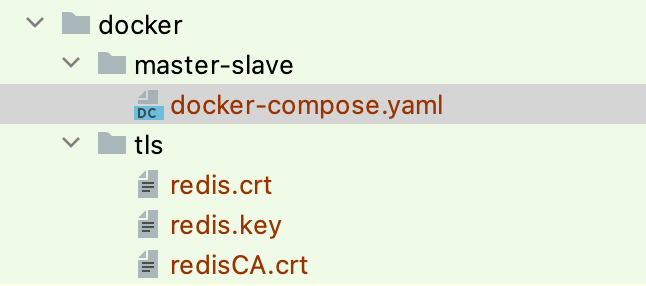

### Redis加密传输

Redis 6.0开始支持tls加密传输，最近刚好要支持，因此需要搭建一套支持加密的Redis环境，于是打算使用自签名来做，但是使用的过程中遇到一些问题，打算记录下来，以方便可能有人也遇到同样的问题。

### 使用[smallstep](https://smallstep.com/)生成自签名根证书

为了方便生成多个中间证书，首先生成自己的自签名根证书，然后使用根证书生成更多的中间证书。比如先生成dengwu.wang的根证书，然后再生成master.dengwu.wang，slave1.dengwu.wang，slave2.dengwu.wang等等子域名证书。

按照官方文档，先安装，mac用户可以使用`brew install step`直接安装，centos可以直接下载二进制文件安装，如下：

先安装step

``` bash
wget -O step.tar.gz https://dl.step.sm/gh-release/cli/docs-ca-install/v0.19.0/step_linux_0.19.0_amd64.tar.gz
tar -xf step.tar.gz
sudo cp step_0.19.0/bin/step /usr/bin
```

再安装step-ca

``` bash
wget -O step-ca.tar.gz https://dl.step.sm/gh-release/certificates/docs-ca-install/v0.19.0/step-ca_linux_0.19.0_amd64.tar.gz
tar -xf step-ca.tar.gz
sudo cp step-ca_0.19.0/bin/step-ca /usr/bin
```

由于dl.step.sm本身的证书不被wget信任，如果下载遇到安全提示，加上--no-check-certificate即可

下载完成后，我们就可以生成根证书了，先执行`step ca init`

``` bash
$ step ca init

✔ What would you like to name your new PKI? (e.g. Smallstep): Example Inc.
✔ What DNS names or IP addresses would you like to add to your new CA? (e.g. ca.smallstep.com[,1.1.1.1,etc.]): localhost
✔ What address will your new CA listen at? (e.g. :443): 127.0.0.1:8443
✔ What would you like to name the first provisioner for your new CA? (e.g. you@smallstep.com): bob@example.com
✔ What do you want your password to be? [leave empty and we will generate one]: abc123

Generating root certificate...
all done!

Generating intermediate certificate...
all done!

✔ Root certificate: /Users/bob/.step/certs/root_ca.crt
✔ Root private key: /Users/bob/.step/secrets/root_ca_key
✔ Root fingerprint: 702a094e239c9eec6f0dcd0a5f65e595bf7ed6614012825c5fe3d1ae1b2fd6ee
✔ Intermediate certificate: /Users/bob/.step/certs/intermediate_ca.crt
✔ Intermediate private key: /Users/bob/.step/secrets/intermediate_ca_key
✔ Default configuration: /Users/bob/.step/config/defaults.json
✔ Certificate Authority configuration: /Users/bob/.step/config/ca.json

Your PKI is ready to go.
```

按照提示按需输入即可，一定要记得设置密码，后续还需要使用。

下面启动根证书服务

``` bash
$ step-ca $(step path)/config/ca.json

Please enter the password to decrypt /Users/bob/.step/secrets/intermediate_ca_key: abc123

2022/04/21 21:28:58 Serving HTTPS on 127.0.0.1:8443 ...
```

### 通过根证书服务器生成中间证书

启动成功后，我们就可以导入ca证书

``` bash
$ step ca bootstrap --ca-url [CA URL] --fingerprint [CA fingerprint]
The root certificate has been saved in /home/alice/.step/certs/root_ca.crt.
Your configuration has been saved in /home/alice/.step/config/defaults.json.
```

CA URL替换成你的ca服务地址，比如可能是127.0.0.1:8443，CA fingerprint就是生成根证书的时候的Root fingerprint

如果找不到了，可以执行`step certificate fingerprint $(step path)/certs/root_ca.crt`获取

导入成功之后，还需要安装一下，让本地电脑信任，否则会导致本地发送请求连接失败

``` bash
➜  ~ step certificate install $(step path)/certs/root_ca.crt
Password:
Certificate /Users/wangdengwu/.step/certs/root_ca.crt has been installed.
X.509v3 Root CA Certificate (ECDSA P-256) [Serial: 2527...6639]
  Subject:     dengwu.wang Root CA
  Issuer:      dengwu.wang Root CA
  Valid from:  2022-04-21T04:45:52Z
          to:  2032-04-18T04:45:52Z
```

Mac的话，就可以在钥匙串访问里看到了



下面，我们就可以向根证书服务申请中间证书了。

``` bash
step ca certificate "redis.dengwu.wang" server.crt server.key
```

获取ca证书

``` bash
step ca root ca.crt
```

这样当前文件夹下就有了server.crt,server.key和ca.crt

### 使用docker启动Redis服务

为了方便，我们使用docker-compose来启动服务

``` yaml
version: "3.9"
services:
  master:
    image: "bitnami/redis:6.2.6"
    restart: always
    container_name: "master"
    volumes:
      - "../tls:/opt/redis/certs"
    environment:
      - TZ=Asia/Shanghai
      - REDIS_REPLICATION_MODE=master
      - REDIS_PASSWORD=hello1234
      - REDIS_TLS_ENABLED=yes
      - REDIS_TLS_AUTH_CLIENTS=no
      - REDIS_TLS_CERT_FILE=/opt/redis/certs/redis.crt
      - REDIS_TLS_KEY_FILE=/opt/redis/certs/redis.key
      - REDIS_TLS_CA_FILE=/opt/redis/certs/redisCA.crt
      - REDIS_TLS_PORT=6380
    command: /opt/bitnami/scripts/redis/run.sh --maxmemory 100mb --tls-replication yes --tls-key-file-pass hello1234
    ports:
      - "6379:6379"
      - "6380:6380"
  slave:
    image: "bitnami/redis:6.2.6"
    restart: always
    container_name: "slave"
    volumes:
      - "../tls:/opt/redis/certs"
    environment:
      - TZ=Asia/Shanghai
      - REDIS_REPLICATION_MODE=slave
      - REDIS_MASTER_HOST=master
      - REDIS_MASTER_PORT_NUMBER=6380
      - REDIS_MASTER_PASSWORD=hello1234
      - REDIS_PASSWORD=hello1234
      - REDIS_TLS_ENABLED=yes
      - REDIS_TLS_AUTH_CLIENTS=no
      - REDIS_TLS_CERT_FILE=/opt/redis/certs/redis.crt
      - REDIS_TLS_KEY_FILE=/opt/redis/certs/redis.key
      - REDIS_TLS_CA_FILE=/opt/redis/certs/redisCA.crt
      - REDIS_TLS_PORT=6380
    command: /opt/bitnami/scripts/redis/run.sh --maxmemory 100mb --tls-replication yes --tls-key-file-pass hello1234
    expose:
      - "6379"
      - "6380"
    depends_on:
      - master
```

需要映射tls文件目录，以便redis启动的时候能找到证书，目录结构如下



我们现在可以使用docker-compose up -d来启动了，如果没啥意外的话，就启动成功了。

下面，我们使用redis-cli来访问一下，由于证书是绑定域名的，如果我们直接访问127.0.0.1的话，是访问失败的，所以还需要修改一下hosts文件绑定域名`127.0.0.1 redis.dengwu.wang`

绑定完后，我们来连接一下

``` bash
➜  redis-cli -h redis.dengwu.wang -p 6380 --tls --cacert ca.crt
redis.dengwu.wang:6380> AUTH hello1234
OK
redis.dengwu.wang:6380> info replication
# Replication
role:master
connected_slaves:1
slave0:ip=172.30.0.2,port=6380,state=online,offset=1120,lag=1
master_failover_state:no-failover
master_replid:6c3011ca5166f406cb9e9e7ac61bf5854c1f61b5
master_replid2:0000000000000000000000000000000000000000
master_repl_offset:1120
second_repl_offset:-1
repl_backlog_active:1
repl_backlog_size:1048576
repl_backlog_first_byte_offset:1
repl_backlog_histlen:1120
redis.dengwu.wang:6380>
```

至此自签名的Redis主从就搭建完毕，使用ca证书即可访问

### 使用Redis的Java客户端jedis等访问

如果你使用Java来访问的话，由于jre的本地ca库并没有当前ca证书，所以还需要导入java的证书库

我们先使用keytool验证一下当前的ca根证书是否合法

``` bash
keytool -v -printcert -file ca.crt
所有者: CN=dengwu.wang Root CA, O=dengwu.wang
发布者: CN=dengwu.wang Root CA, O=dengwu.wang
序列号: be26c0031e2f5b03c517dd5ec02a830f
有效期为 Thu Apr 21 12:45:52 CST 2022 至 Sun Apr 18 12:45:52 CST 2032
证书指纹:
	 MD5:  BD:0A:F7:2B:44:A7:27:3E:6F:6E:82:CC:3C:98:69:56
	 SHA1: 51:89:F7:4E:7C:3E:AD:DC:92:14:00:28:87:E0:23:E1:EA:D2:88:AC
	 SHA256: 2D:06:83:E4:28:D5:E5:8C:2E:A9:DF:B0:24:37:0F:B6:46:7A:E8:7B:17:EA:D6:88:15:4F:BA:3F:84:BC:0F:DA
签名算法名称: SHA256withECDSA
主体公共密钥算法: 256 位 EC 密钥
版本: 3

扩展:

#1: ObjectId: 2.5.29.19 Criticality=true
BasicConstraints:[
  CA:true
  PathLen:1
]

#2: ObjectId: 2.5.29.15 Criticality=true
KeyUsage [
  Key_CertSign
  Crl_Sign
]

#3: ObjectId: 2.5.29.14 Criticality=false
SubjectKeyIdentifier [
KeyIdentifier [
0000: 79 5D 02 C3 B7 0E DC 97   56 A6 5A 30 30 30 63 93  y]......V.Z000c.
0010: 76 33 9A 97                                        v3..
]
]
```

说明格式没问题，下面导入java的ca库

``` bash
sudo keytool -import -alias dengwu.wang -keystore $JAVA_HOME/jre/lib/security/cacerts -storepass changeit -file ca.crt
Password:
所有者: CN=dengwu.wang Root CA, O=dengwu.wang
发布者: CN=dengwu.wang Root CA, O=dengwu.wang
序列号: be26c0031e2f5b03c517dd5ec02a830f
有效期为 Thu Apr 21 12:45:52 CST 2022 至 Sun Apr 18 12:45:52 CST 2032
证书指纹:
	 MD5:  BD:0A:F7:2B:44:A7:27:3E:6F:6E:82:CC:3C:98:69:56
	 SHA1: 51:89:F7:4E:7C:3E:AD:DC:92:14:00:28:87:E0:23:E1:EA:D2:88:AC
	 SHA256: 2D:06:83:E4:28:D5:E5:8C:2E:A9:DF:B0:24:37:0F:B6:46:7A:E8:7B:17:EA:D6:88:15:4F:BA:3F:84:BC:0F:DA
签名算法名称: SHA256withECDSA
主体公共密钥算法: 256 位 EC 密钥
版本: 3

扩展:

#1: ObjectId: 2.5.29.19 Criticality=true
BasicConstraints:[
  CA:true
  PathLen:1
]

#2: ObjectId: 2.5.29.15 Criticality=true
KeyUsage [
  Key_CertSign
  Crl_Sign
]

#3: ObjectId: 2.5.29.14 Criticality=false
SubjectKeyIdentifier [
KeyIdentifier [
0000: 79 5D 02 C3 B7 0E DC 97   56 A6 5A 30 30 30 63 93  y]......V.Z000c.
0010: 76 33 9A 97                                        v3..
]
]

是否信任此证书? [否]:  是
证书已添加到密钥库中
```

执行`keytool -list -trustcacerts -keystore $JAVA_HOME/jre/lib/security/cacerts -storepass changeit |grep dengwu.wang`搜索一下

dengwu.wang, 2022-4-21, trustedCertEntry,

说明已经成功，我们使用jedis来试一下

``` java
@Test
public void test_redis_tls_with_jedis(){
    Jedis jedis = new Jedis("rediss://redis.dengwu.wang:6380");
    jedis.auth("hello1234");
    jedis.set("1","1", SetParams.setParams().ex(10));
}
```

执行成功。

### 单元测试

有时候我们需要执行单元测试，如果是本地跑，可以方便的导入证书和修改hosts，但是有时候测试需要在cd服务器上跑，环境不受控制，那如何解决域名和证书问题呢？

答案就是fake或mock，我们可以通过修改jdk运行时的私有数据，来达到绑定域名和导入证书的目的。

#### 解决域名问题

``` java
import com.google.common.collect.ImmutableMap;
import org.testcontainers.shaded.org.apache.commons.lang3.reflect.FieldUtils;
import sun.net.spi.nameservice.NameService;

import java.net.InetAddress;
import java.net.UnknownHostException;
import java.util.List;
import java.util.Map;

@SuppressWarnings("all")
public final class MockNameService implements NameService {
    private final String local = "127.0.0.1";
    private final Map<String, String> mockHost = ImmutableMap
            .<String, String>builder()
            .put("master.dengwu.wang", local)
            .put("slave1.dengwu.wang", local)
            .put("slave2.dengwu.wang", local)
            .build();

    public static void mockHosts() {
        try {
            //通过反射拿到nameService列表
            List<NameService> nameServices =
                    (List<sun.net.spi.nameservice.NameService>)
                            FieldUtils.readStaticField(InetAddress.class, "nameServices", true);
            //加入自己的mockNameService
            nameServices.add(new MockNameService());
        } catch (IllegalAccessException e) {
            throw new RuntimeException(e);
        }
    }

    @Override
    public InetAddress[] lookupAllHostAddr(String paramString) throws UnknownHostException {
        //mock逻辑
        if (mockHost.keySet().contains(paramString)) {
            final byte[] arrayOfByte = sun.net.util.IPAddressUtil.textToNumericFormatV4(mockHost.get(paramString));
            final InetAddress address = InetAddress.getByAddress(paramString, arrayOfByte);
            return new InetAddress[]{address};
        } else {
            return null;
        }
    }

    @Override
    public String getHostByAddr(byte[] paramArrayOfByte) throws UnknownHostException {
        throw new UnknownHostException();
    }
}
```

#### 解决JDK的根证书问题

``` java
import org.testcontainers.shaded.org.apache.commons.lang3.reflect.FieldUtils;
import sun.security.ssl.SSLContextImpl;

import javax.net.ssl.SSLContext;
import javax.net.ssl.TrustManager;
import javax.net.ssl.TrustManagerFactory;
import java.io.IOException;
import java.io.InputStream;
import java.security.KeyStore;
import java.security.KeyStoreException;
import java.security.NoSuchAlgorithmException;
import java.security.cert.CertificateException;

public final class FakeX509TrustManager {

    private static final String DOCKER_TLS_KEYSTORE_JKS = "docker/tls/cacerts";
    public static final String KEYSTORE_PASSWORD = "changeit";

    public static void fakeTrustManager() {
        try (InputStream keyStoreInputStream = ClassLoader.getSystemClassLoader().getResourceAsStream(DOCKER_TLS_KEYSTORE_JKS)) {
            SSLContext defaultSSLContext = SSLContext.getDefault();
            SSLContextImpl sslContext = (SSLContextImpl) FieldUtils.readField(defaultSSLContext, "contextSpi", true);
            TrustManagerFactory tmf = TrustManagerFactory.getInstance("SunX509");
            KeyStore ks = KeyStore.getInstance("JKS");
            ks.load(keyStoreInputStream, KEYSTORE_PASSWORD.toCharArray());
            tmf.init(ks);
            TrustManager[] trustManagers = tmf.getTrustManagers();
            FieldUtils.writeField(sslContext, "trustManager", trustManagers[0], true);
        } catch (CertificateException | NoSuchAlgorithmException | KeyStoreException | IOException |
                 IllegalAccessException e) {
            throw new RuntimeException(e);
        }
    }
}
```

思路就是将之前已经导入CA证书的本地JDK的KeyStore复用，但是JDK没有暴露对应的API，那就只能通过反射拿到，注意JDK的KeyStore默认密码是changeit，格式是JKS的

#### 使用

只需要在单元测试的类里，静态调用一下就可以了

``` java
static {
  MockNameService.mockHosts();
  FakeX509TrustManager.fakeTrustManager();
}
```

#### Redis环境问题

如果有现成的Redis环境，则可以跑集成测试，但是如果没有，那使用docker是个不错的选择，但是单元测试往往需要启动时初始化环境，跑完就销毁即可，那如何将docker和Junit结合呢？

可以使用testcontainers，结合docker-compose文件，很方便的测试之前启动docker环境，测试结束销毁docker容器

``` java
@Testcontainers
@IfProfileValue(name = "spring.profiles.active", value = "readwrite")
public class ClientReadWriteTests {
  @ClassRule
  @Container
  public static final DockerComposeContainer masterSlaves = new DockerComposeContainer(new File(masterDockerComposeFile))
          .withLocalCompose(true);
}
```

另外还可以通过profile来隔离不同的测试场景，比如主从场景，集群场景，读写分离场景等等
